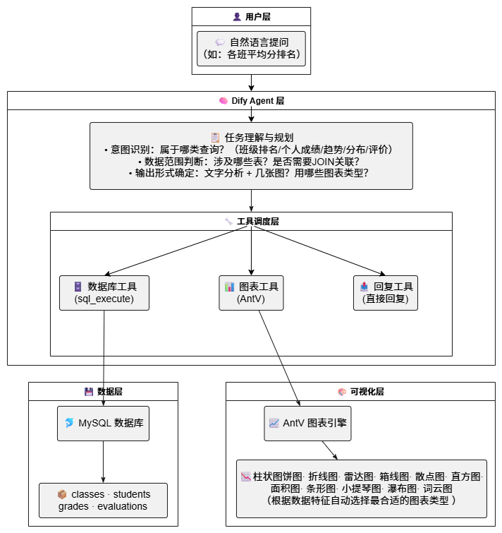
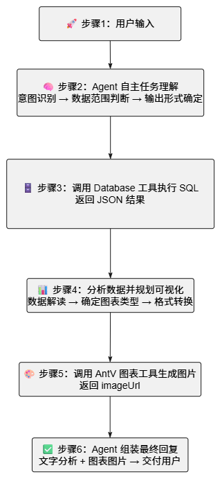
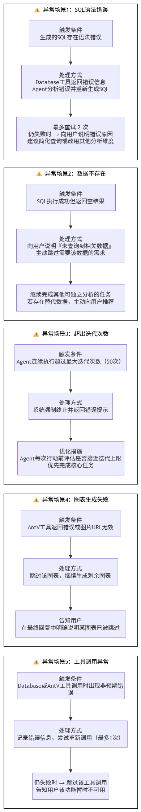

# 02-技术架构图

## 1. 整体架构
本系统基于 Dify Agent 构建，采用「用户输入 → Agent自主推理 → 工具调用 → 结果交付」的闭环架构。

## 2. 完整链路详解

### 端到端执行流程

### 异常处理链路

## 3. 使用到的工具

### 3.1 Database 工具（hjlarry/database）

| 配置项 | 说明 |
| :--- | :--- |
| **功能** | 执行 MySQL 查询，返回结构化 JSON 数据 |
| **连接方式** | `mysql+pymysql://用户名:密码@主机地址:端口/数据库名` |
| **安全设计** | 禁止 DROP/DELETE/UPDATE 等危险操作 |
| **数据源** | `dify_test_v2` 测试数据库 |
| **调用方式** | Agent 自主生成 SQL 并调用 |

### 3.2 AntV 可视化图表工具（antv/visualization）

本系统集成了 12 种 AntV 图表工具，根据数据特征自动选择：

| 图表类型 | 工具名 | 适用场景 |
| :--- | :--- | :--- |
| 柱状图 | `visualization 生成柱状图` | 类别对比（班级排名、科目对比） |
| 饼图 | `visualization 生成饼图` | 占比分布（成绩分段比例） |
| 折线图 | `visualization 生成折线图` | 时间趋势（各学期成绩变化） |
| 面积图 | `visualization 生成面积图` | 时间趋势 + 累积量展示 |
| 雷达图 | `visualization 生成雷达图` | 多维度综合对比（各科能力画像） |
| 箱线图 | `visualization 生成箱线图` | 分布统计（成绩分散程度） |
| 小提琴图 | `visualization 生成小提琴图` | 分布形态与密度（增强版箱线图） |
| 散点图 | `visualization 生成散点图` | 两变量相关性（数学与物理） |
| 直方图 | `visualization 生成直方图` | 频数分布（各分数段人数） |
| 条形图 | `visualization 生成条形图` | 长标签类别对比（柱状图水平版） |
| 瀑布图 | `visualization 生成瀑布图` | 累积变化（各学期成绩累积） |
| 词云图 | `visualization 生成词云图` | 文本评价分析（教师评价关键词） |

## 4. 为什么选择这套架构？

### 4.1 为什么选择 Dify Agent 而非工作流？

| 对比维度 | Agent 模式（本方案） | Workflow 模式（传统方案） |
| :--- | :--- | :--- |
| **灵活性** | ✅ 高，可自适应不同类型的用户问题 | ❌ 低，需预设所有执行路径 |
| **工具调用** | ✅ 按需自主调用，动态组合 | ❌ 需预编排节点顺序 |
| **场景适应性** | ✅ 适合开放性问题（成绩分析场景多变） | ❌ 适合固定流程任务 |
| **扩展性** | ✅ 新增图表只需修改提示词 + 工具配置 | ❌ 需修改工作流结构 |
| **可维护性** | ✅ 提示词驱动，迭代成本低 | ❌ 节点调整复杂 |

### 4.2 为什么选择 MySQL？

| 考虑维度 | 说明 |
| :--- | :--- |
| **真实场景匹配** | 学校成绩数据通常存储在关系型数据库中，MySQL 是最广泛使用的方案 |
| **查询能力成熟** | 支持复杂 JOIN、窗口函数、聚合分析 |
| **便于评审复现** | 标准 SQL 语句，评审可快速部署验证 |
| **技术栈通用** | 无需学习专有查询语言 |

### 4.3 为什么选择 AntV 作为可视化方案？

| 考虑维度 | 说明 |
| :--- | :--- |
| **图表类型丰富** | 支持本作品所需的全部 12 种图表类型 |
| **数据格式友好** | 直接接受 JSON 数组，与 Agent 输出天然匹配 |
| **图片生成稳定** | 返回可直接展示的图片 URL，简化回复构建 |
| **零配置使用** | Dify 插件市场一键安装，无需 API Key |

### 4.4 为什么采用“提示词驱动”而非“代码驱动”？

| 考虑维度 | 说明 |
| :--- | :--- |
| **迭代速度** | 修改提示词即可优化行为，无需重启服务 |
| **可观测性** | Agent 的推理过程可输出，便于调试和效果验证 |
| **可复制性** | 提示词可以随项目导出，评审可直接导入使用 |
| **低门槛** | 非技术人员也能理解和参与提示词优化 |

### 4.5 架构的核心设计思想

1. **模块解耦**：数据层、Agent推理层、工具调度层、可视化层各司其职
2. **自然语言驱动**：用户用自然语言提问，Agent 用自然语言输出分析
3. **自主推理**：Agent 自主规划任务、调用工具、组合结果
4. **提示词为中心**：系统的核心能力通过提示词定义，而非硬编码
